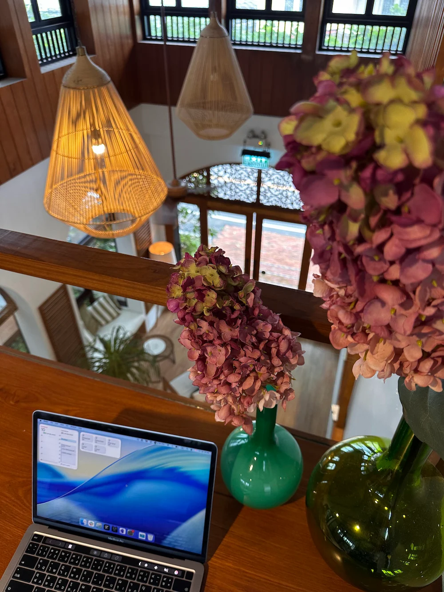
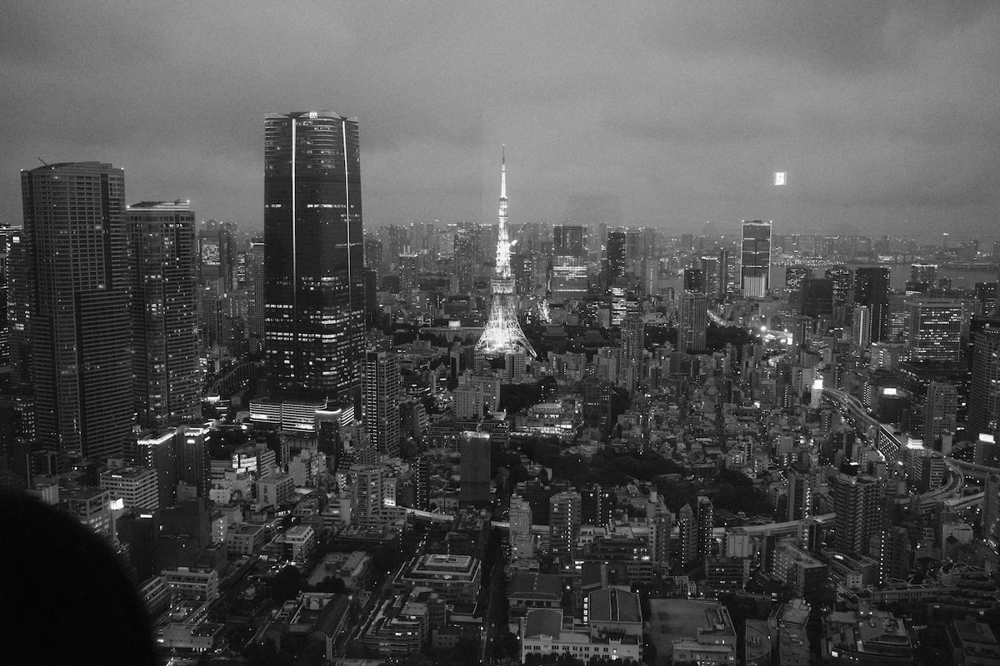

# First concert

Last year I became a fan of the band *No One Else*. This year in
February they had their first ever concert, and so it became my first
concert, too. I never went to any concert prior to this one.

I could not imagine what they were feeling when they bowed as the show
came to an end; it's the moment I would call a *success*. This band is
a flower that took 10 years to bloom, and I'm so proud of them.
This band reminds me that *that* moment can happen to you even in
your 40s.

Not all flowers bloom at the same time.

# First open source contributions

I was searching for a version manager for Bun, and proto became
my answer because it supported not just Bun but a whole lot of tools
that I used, including Ruby. The problem was it did not support the
`irb` shim that came with Ruby.

I had been learning Rust for a couple of months so I decided to solve
this issue by myself because proto was written in Rust. It turned out
to be quite a simple fix with a real value.

Here are the pull requests.

- https://github.com/moonrepo/proto/pull/897
- https://github.com/moonrepo/plugins/pull/92

# Maths

I have never understood anything in maths since grade 4, except some
of the more 'non-numerical' topics like logic, but my close friend
knew the right problem: the teacher. I had a bad maths teacher in
high school that made me hate learning maths.

This year I decided to break free from this barrier and overcome this
fear by going back to pre-algebra and algebra. I'm using Khan Academy
as my self-study resources and it actually works. I'm very proud of
myself that I can now understand topics that I never understood
in school. I'm still studying algebra so I'm not yet into the more
advanced topics.

I decided to do this because if I want to study abroad for a Master's
degree, I will have to use maths both for admission and study.

# Life

Life is like sailing: you can't control the sea. I'm lucky to be in
the position where I can say "we have each other's back" and I'm
grateful for that. Medical advancement is one of the closest things
to a miracle. Still, we are fighting. I appreciate each day as a gift
and I'm so grateful that we have got to be with each other.

On relationships, I can say that this year I have improved my
relationship with my best friend a lot because we have been more open
with our feelings and we have spent a lot of time together.
Communication is key. When there is a problem, talk about it and sort
it out.

I encouraged my friend to finally get his own camera, and he did.
We have been going out more often and I can see how the camera
(or *having a camera* in general) has improved him a lot, emotionally.
This also means more opportunities for me to go out and take photos.

This year my life goals swayed a lot. I saw successful or genius
persons and I wanted to be like them. Then I saw this powerful speech
by Jane Goodall which changed how I think.

> Each and every one of you has a role to play. You may not know it.
> You may not find it. But your life matters.

https://www.youtube.com/watch?v=lfLKHY52ERc

Every human being is different, and these differences make the world
a better place. We don't have to be good at the same thing. Do what
you love; success or achievements are an added bonus, not a goal.

# Career

This year I have got a chance to lead a squad of four for a new
feature and we have made a successful delivery, albeit a lot of changes.

I was placed as the Technical Lead for this team with no expectation
to code because I was also on another team. My role was to give
guidance and support, and to arrange the delivery.

This was an entirely new experience and I had the feeling that I was
not contributing enough because I did not get my hands dirty. I felt
like there was so much more that I could do. This doubt had stayed
with me until my manager told me that "not every contribution came in
the form of coding."

My product manager also mentioned in our last retrospective session of
the year that I was the youngest engineer on the team when I joined
in 2022. Looking back to that, I could see I have grown a lot.

You realise how far you have come when you look back.

# Travel

This year I travelled to the east a lot: Chantaburi in July, Trat in
September and November. In February I flew to Chiang Mai, and
of course, a year could not go by without Khao Yai, our family ritual.

In June I went to Japan, which was my first ever solo trip.
Actually there is a lot of *firsts* in this trip:

- First time in Tokyo.
- First time meeting my Chinese colleague (who works in our Japanese team).
- First time taking the Shinkanzen.
- First time on Thai Airways.
- First time staying at a hostel.
- First time visiting Kyoto for the third time 😆.

On the Shinkanzen I met a Chinese lady who travelled with her family.
She was surprised (in a good way) that I was travelling alone.
Some of my friends also told me the same, and that made me think it
was one thing to be proud of.

In this trip I also crossed out my long time wish list: an RC crawler.

# Final notes

Life is too short to waste time arguing with each other.
Reading helps you realise what you don't know.
